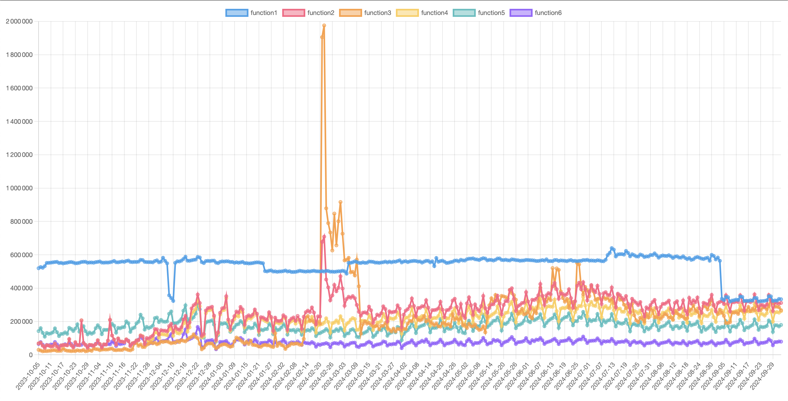

# Lambda Invocations Plotter

This script plots the invocations of AWS Lambda functions over a given time period. It uses the AWS SDK to fetch the necessary data from AWS CloudWatch and AWS Lambda.



## Prerequisites

- Node.js
- AWS CLI
- AWS credentials

## Installation

1. Clone the repository:

```
git clone https://github.com/cyprieng/lambda-invocations-plotter.git
```

2. Install dependencies:

```
npm install
```

## Usage

```
node main.js
```

It will prompt you for the number of days you want to plot and the number of functions you want to plot (keeping the most invoked ones).
It will then fetch the data from AWS and plot it by opening your default browser (you can find an example [here](example/example.html)).

## AWS Policy

You need to have the following policy on your AWS user or role:

```
{
    "Version": "2012-10-17",
    "Statement": [
        {
            "Sid": "VisualEditor0",
            "Effect": "Allow",
            "Action": [
                "lambda:ListFunctions",
                "cloudwatch:GetMetricStatistics"
            ],
            "Resource": "*"
        }
    ]
}
```
